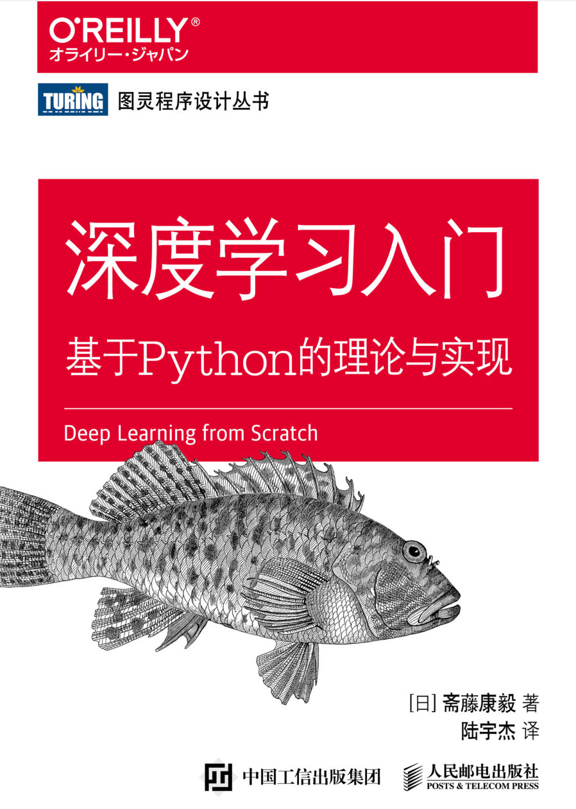

---

<h2 align="center"> 最近的学习经历 </h2>

    
    
深度学习入门基于 Python 的理论和实现

因为要做毕业设计，所以花了 3、4 天的时间来看这本书大致学习一下深度学习，内容很容易接受，适合初学者。之前有在无聊的时候看过 `3B1B` 的视频，讲解流程大致相当，当个入门的轻松读物非常好。

    <iframe width="560" height="315" src="https://www.youtube.com/embed/aircAruvnKk" title="YouTube video player" frameborder="0" allow="accelerometer; autoplay; clipboard-write; encrypted-media; gyroscope; picture-in-picture" allowfullscreen></iframe>

<!-- more -->

---

除此之外，还需要学习一下 `pytorch` 框架的使用，在 `bilibili` 上播放量最高的视频收声还有讲解的文稿实在是惨不忍睹，讲的东西不是太钻牛角尖就是太详略， 缺少一个全局的概览，在最开始就钻进了某个小部件的讲解中，对初学者来说缺少指导意义，对懂得原理的人来说又太啰嗦。所以我在 youtube 上找了一个讲解，整体思路很清晰，总时长也不过 5 小时。
