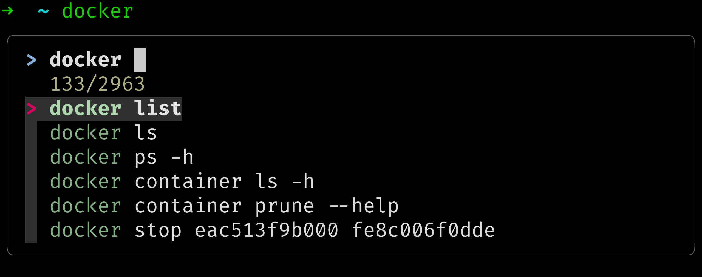

## 设置历史命令查看

这里我想达到的目的是按下 `C-r` 按键时会弹出窗口来选择历史，并且带有模糊搜索的功能。恰好 `fzf` 命令有这个功能，用包管理器安装好之后，就可以开始写小脚本了。


<!-- more -->




```bash
# select history command in fzf mode
function hist(){
    if [ $#LBUFFER -gt 0 ]; then
        BUFFER=$(history -n | awk '!seen[$0]++' | fzf -e --reverse --no-sort --tac --border=rounded --height=50% --query $LBUFFER)
    else
        BUFFER=$(history -n | awk '!seen[$0]++' | fzf -e --reverse --no-sort --tac --border=rounded --height=50%)
    fi
    CURSOR=$#BUFFER
    zle redisplay
}
zle -N hist
bindkey '^r' hist
```

### 解释

```bash
history -n | awk '!seen[$0]++' | fzf -e --reverse --no-sort --tac --border=rounded --height=50%
```

首先看看 `history` 命令输出的格式，看到 `omz_history` 默认是带有前面的数字的，我们把它用 `-n` 选项取消掉。

```bash
➜ repo ✗ history | tail
 6174  docker container ls -a
 6175  docker container ls -h
 6176  docker ps -h
 6177  docker ls
 6178  docker list
 6179  which history
```

管道中的第二命令 `awk '!seen[$0]++'` 是用来去重的 [^1]，使用 `uniq` 命令的话需要将 history 排序，并不符合我们的需求。

最后就是 `fzf` 命令了。简单解释一下，`fzf` 能接受多行输入，将之变成一个选择界面。`--reverse --border=rounded --height=50%` 这几个选项都是调整布局的选项。其他几个选项的解释如下。

```
-e 开启精确匹配
--no-sort 不要排序
--tac 逆转输入，因为我们希望最后的历史记录在最前面
--query 查询词
```

最后使用 `zle`(zsh line editor) 来把我们选择的命令写入命令行当中

## 设置 snippets

使用别人写好的工具 [pet](https://github.com/knqyf263/pet)。相比于自己在 shell 中实现，`pet` 提供了将 `snippets` 同步到仓库的功能（虽然自己写也不难）。

```bash
# Select snippets at the current line (like C-r)
function pet-select() {
  BUFFER=$(pet search --color --query "$LBUFFER")
  CURSOR=$#BUFFER
  zle redisplay
}
zle -N pet-select
stty -ixon
bindkey '^s' pet-select
```

[^1]: https://unix.stackexchange.com/questions/11939/how-to-get-only-the-unique-results-without-having-to-sort-data
[^2]: https://www.alajmovic.com/posts/recording-terminal-commands-and-generating-gifs/index.html
